# Desafios Bônus

## Automação com User Data

### Configurar a EC2 para já iniciar com Nginx, HTML e script de monitoramento via User Data.

1) Ao criar uma intancia Ec2 Colocar o bash no campo do user data.

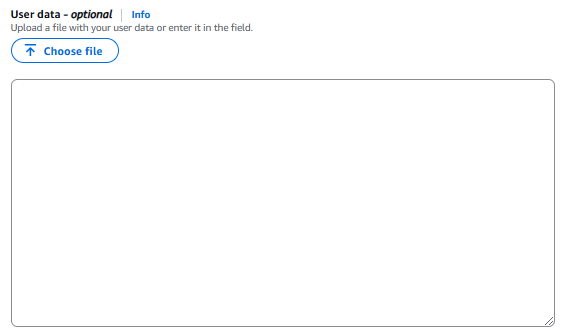 

<hr>
<div>
<details>
    <summary>Explicação do user data:  </summary>

```
#!/bin/bash

# Adiciona um novo repositório para o Nginx no sistema, permitindo a instalação do Nginx a partir do repositório oficial.
sudo cat << 'EOF' >> /etc/yum.repos.d/nginx.repo
[nginx-stable]
name=nginx stable repo
baseurl=http://nginx.org/packages/amzn2/$releasever/$basearch/
gpgcheck=1
enabled=1
gpgkey=https://nginx.org/keys/nginx_signing.key
module_hotfixes=true
priority=9
EOF

# Instala o pacote cronie, que é responsável por agendar tarefas no sistema.
sudo yum install cronie -y
# Inicia o serviço crond, que é o daemon do cron.
sudo systemctl start crond
# Habilita o serviço crond para iniciar automaticamente na inicialização do sistema.
sudo systemctl enable crond

# Atualiza todos os pacotes instalados no sistema para suas versões mais recentes.
sudo yum update -y

# Instala o pacote perl-Sys-Hostname, que é necessário para obter o nome do host.
sudo yum install perl-Sys-Hostname -y

# Instala vários pacotes Perl necessários para executar scripts de monitoramento do CloudWatch.
sudo yum install -y perl-Switch perl-DateTime perl-Sys-Syslog perl-LWP-Protocol-https perl-Digest-SHA.x86_64


# Navega até o diretório home do usuário ec2-user.
cd /home/ec2-user/

# Baixa o script de monitoramento do CloudWatch da AWS.
curl https://aws-cloudwatch.s3.amazonaws.com/downloads/CloudWatchMonitoringScripts-1.2.2.zip -O

# Descompacta o arquivo zip baixado.
unzip CloudWatchMonitoringScripts-1.2.2.zip

# Remove o arquivo zip após a descompactação.
rm -rf CloudWatchMonitoringScripts-1.2.2.zip

# Instala o Nginx a partir do repositório configurado anteriormente.
sudo yum install nginx -y

# Cria um arquivo HTML básico no diretório padrão do Nginx.
sudo cat << 'EOF' > /usr/share/nginx/html/index.html
<!DOCTYPE html>
EOF

# Habilita o Nginx para iniciar automaticamente na inicialização do sistema e inicia o serviço imediatamente.
sudo systemctl enable nginx --now

# Define o caminho onde o script de monitoramento será salvo.
MONITOR_SCRIPT="/usr/local/bin/monitor.sh"

# Cria um script de monitoramento que verifica se o site está online e envia notificações no Discord se estiver offline.
sudo cat << EOF > $MONITOR_SCRIPT
#!/bin/bash

# Define a URL do site que será monitorado.
SITE_URL="http://localhost:80"  # Especificando a porta 80 explicitamente

# Define o arquivo de log onde as mensagens de monitoramento serão armazenadas.
LOG_FILE="/var/log/monitoramento.log"
# Define o webhook do Discord para enviar notificações.
DISCORD_WEBHOOK="https://discord.com/api/webhooks/1339668365723046040/z-g8k_ZO3_eErqlzNyADSLvi3K0-INRQuCMO4vDx3X3DoEJkYdYOgi1NDUzLmRHXB8UB"


# Função para registrar mensagens no arquivo de log.
log() {
    local message="$1"
    echo "$(date '+%Y-%m-%d %H:%M:%S') - $message" >> "$LOG_FILE"
}

# Função para enviar mensagens para o Discord usando o webhook.
notificar_discord() {
    local message="$1"
    curl -H "Content-Type: application/json" -X POST -d "{\"content\": \"$message\"}" "$DISCORD_WEBHOOK"
}

# Verifica o status do site usando o comando curl.
response=$(curl -o /dev/null -s -w "%{http_code}" "$SITE_URL")

# Se o site estiver online (código de resposta 200), registra no log.
if [[ "$response" -eq 200 ]]; then
    log "Site $SITE_URL está online. Código de resposta: $response"
else

# Se o site estiver offline, registra no log e envia uma notificação no Discord.
    log "Site $SITE_URL está offline. Código de resposta: $response"
    notificar_discord "🚨 ALERTA: O site $SITE_URL está offline! Código de resposta: $response"
fi
EOF


# Torna o script de monitoramento executável.
sudo chmod +x $MONITOR_SCRIPT

# Adiciona uma entrada no crontab para executar o script de monitoramento a cada minuto.
(crontab -l 2>/dev/null; echo "* * * * * $MONITOR_SCRIPT") | crontab -

# Adiciona uma entrada no crontab para enviar dados de memória para o CloudWatch a cada minuto.
(crontab -l 2>/dev/null; echo "* * * * * /home/ec2-user/aws-scripts-mon/mon-put-instance-data.pl --mem-util --mem-used --mem-avail") | crontab -

# Exibe uma mensagem indicando que a configuração foi concluída com sucesso.

echo "Configuração concluída! O Nginx está instalado e o monitoramento está ativo."
```
</details>
</div>
<hr>

2) Criar a instancia.

<br>

> [!IMPORTANT]
> <hr>Foi criado com base no script disponibilizado pelo professor: Aula 46. Preparação do laboratório sobre Application Load Balancer (ALB).<hr>Curso Udemy: AWS, na prática!<br>Seção 3: AMAZON EC2

## Criação de um template CloudFormation ou Terraform:

### Criar um arquivo YAML do CloudFormation que provisiona toda a infraestrutura automaticamente.

> [!NOTE]
> Estou utilizando o Windows 11 com o wsl rodando, e estou utilizando o terminal do vscode!!!.

1) Tive que baixar o unzip pois não tinha instalado por padrão na maquina, comando:

**sudo apt update**
**sudo apt install unzip**

2) baixei o cli da aws na minha wsl comando:

**curl "https://awscli.amazonaws.com/awscli-exe-linux-x86_64.zip" -o "awscliv2.zip"
unzip awscliv2.zip
sudo ./aws/install**

> [!CAUTION]
> Após instalar o aws cli conficgura-lo com o comando: **aws configure** (após digitar o comando é só colocar a acess key e a secret do usuário que criou anteriormente (no meu caso o nome era terraform) e por fim na configuração colocar a zona us-east-1)


3) Baixei o terraform via linha de comando(no site principal deles te disponibilizam o link)

**wget -O - https://apt.releases.hashicorp.com/gpg | sudo gpg --dearmor -o /usr/share/keyrings/hashicorp-archive-keyring.gpg
echo "deb [arch=$(dpkg --print-architecture) signed-by=/usr/share/keyrings/hashicorp-archive-keyring.gpg] https://apt.releases.hashicorp.com $(lsb_release -cs) main" | sudo tee /etc/apt/sources.list.d/hashicorp.list
sudo apt update && sudo apt install terraform**

4) Após isso criei um usuário no console da aws chamado "terraform" atribui o acesso de admin a ele e criei uma chave de acesso, baixei o csv pra prevenir possíveis dores de cabeça

5) Abri o console da minha wsl e configurei o acesso dá aws.

6) Após isso, abri o site **terraform.io**.

7) Fui em registry cliquei na aws.

8) Selecionei os documentos desejados.

9) Alterei o documento comforme a documentação pedia.

10) Com a documentação aberta criei um arquivo chamado main.tf e é nele que criaremos toda a infraestrutura de TI. 

> [!CAUTION]
> Sempre que for criar uma infra no terraform, ir criando e testando um recurso apenas, e depois juntar todos eles no final.

Caminho para a aplicação do script (main.tf):

```
1- terraform init
2- terraform plan
3- terraform apply
```

## Monitoramento avançado

### Enviar estatísticas para CloudWatch e configurar alarmas na AWS.

1) Criei uma role (no IAM) que ela da permissão total para que a ec2 mande os arquivos para o cloudWatch.

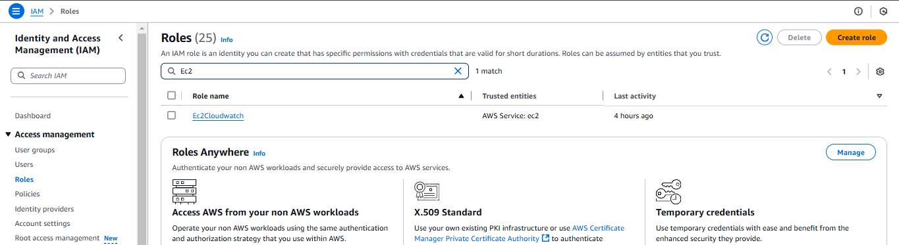 

2) Criei uma ec2 e atribui a ela a role criada anteriormente.

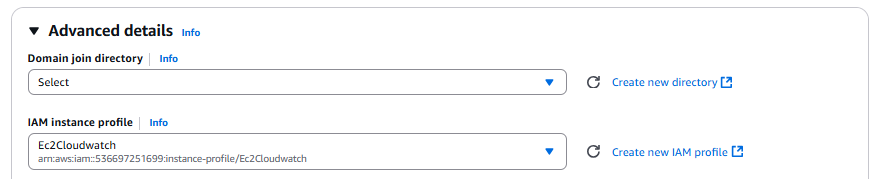 

3) agora dentro da ec2 que criamos:

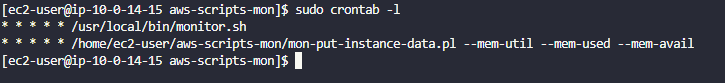 

- Executar o *bootstrap.sh* para baixar todos pacotes e suas dependências para que possamos enviar as estatísticas para o cloudWatch


Bootstrap.sh: 
```
yum update -y
sudo yum install perl-Sys-Hostname -y
sudo yum install -y perl-Switch perl-DateTime perl-Sys-Syslog perl-LWP-Protocol-https perl-Digest-SHA.x86_64
cd /home/ec2-user/
curl https://aws-cloudwatch.s3.amazonaws.com/downloads/CloudWatchMonitoringScripts-1.2.2.zip -O
unzip CloudWatchMonitoringScripts-1.2.2.zip
rm -rf CloudWatchMonitoringScripts-1.2.2.zip
```

Para fazer uma validação(se está funcionando corretamente):

**./mon-put-instance-data.pl --mem-util --verify --verbose**

Após fazer a verificação agora mandaremos para o cloudwatch a memória utilizada e a disponível.

**./mon-put-instance-data.pl --mem-util --mem-avail --mem-used**

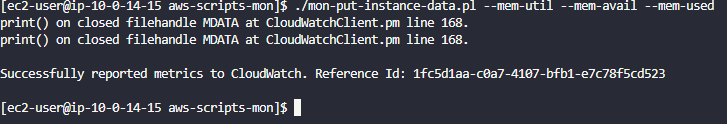 

4) Copiar o ID da sua instancia.

5) Entrar no console da aws e acessar o cloudwatch(Exatamente a aba de Alarms:in alarm)

6) Criar um alarme de acordo com a sua necessidade.

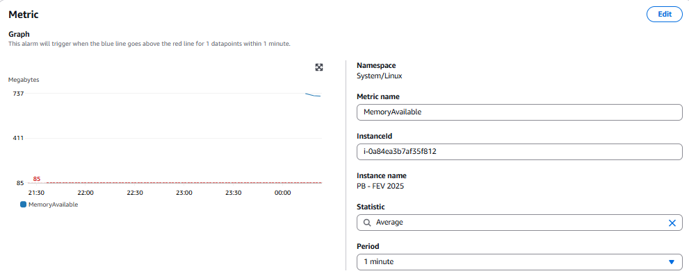 
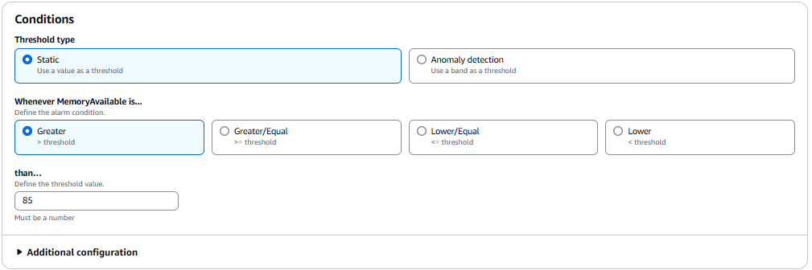 
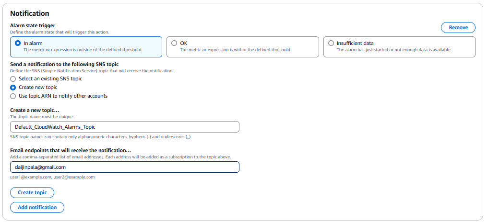 
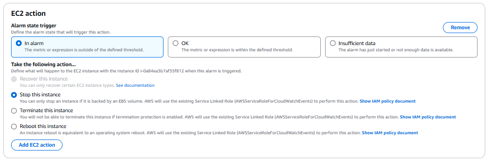 
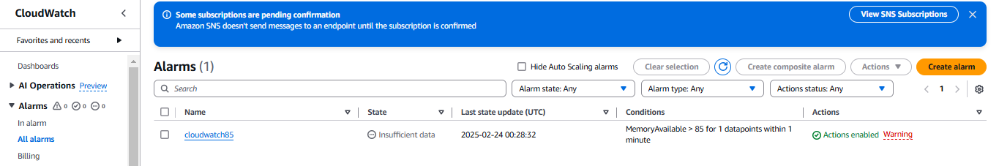 
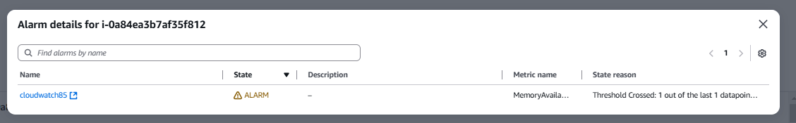 

Para testar se o alarme está funcionando: 

**aws cloudwatch set-alarm-state --alarm-name "nome do alarme que criamos" --state-value ALARM --state-reason "motivo do teste"**

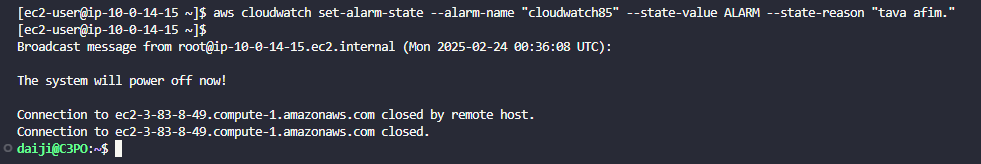 
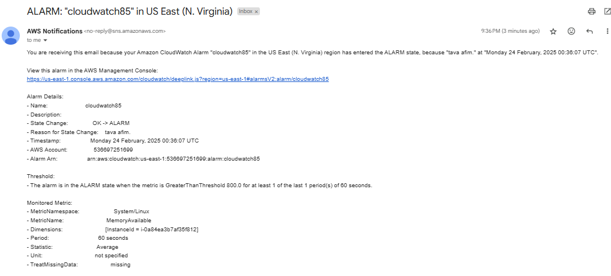 