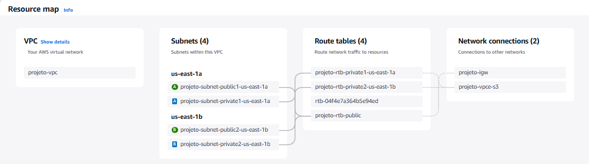
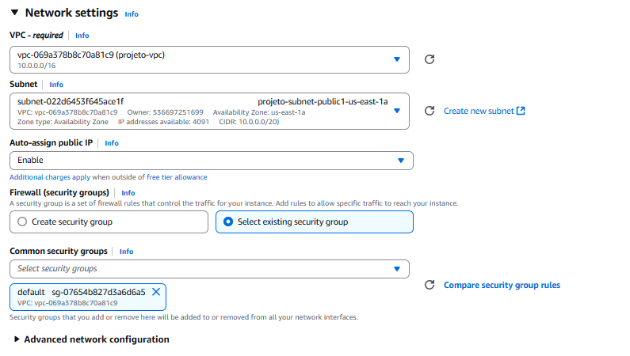
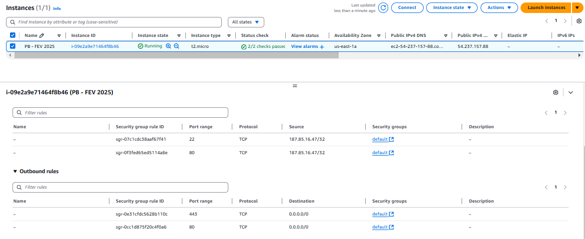
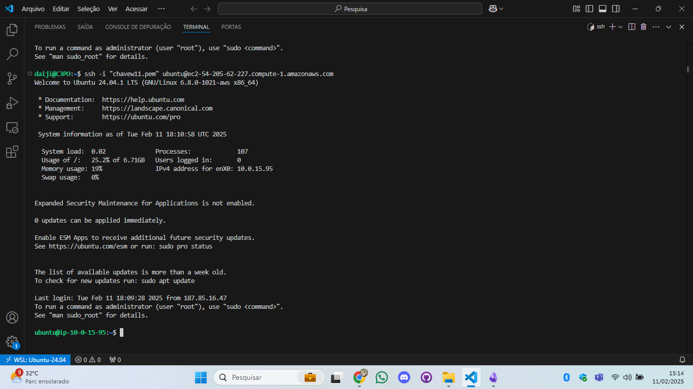

# Configurando o ambiente.
> [!IMPORTANT]
> É necessario ressaltar que este projeto foi feito utilizando o wsl por questões de preferência, podendo utilizar outros métodos.<br>Exemplo: fazer tudo pelo CLI da Amazon sem utilizar nenhum editor de código como o vscode citado futuramente.
## Criação do ambiente wsl (Windows Subsystem for Linux)
1) Instalei o wsl e o ubuntu 24.04 pela **Microsoft store**.
2) Entrei no visual code e baixei a extensão **remote wsl**.
3) Cliquei lá em baixo no sinal de >< (no canto inferior esquerdo).
4) Cliquei para fazer login e entrei no wsl.
5) Tive que mover a chave da minha Ec2 para o wsl.

> [!NOTE]
> Como foi feito para mover a chave ?<br><br>Entrar no wsl e acessar a area de trabalho do windows:<br>**cd /mnt/c/Users/usuario_windows/Desktop/**<br>Após isso mover a chave para o wsl:<br>**mv chavew.pem /home/usuario_linux/**

## Configuração do Ambiente (aws)

<div>
<h6> Criar uma VPC na AWS com:</h6>
<ul>
<li> 2 sub-redes públicas (para
acesso externo).</li>
<li> 2 sub-redes privadas (para
futuras expansões).</li>
<li>Uma Internet Gateway conectada
às sub-redes públicas.</li>
</ul>
</div>



<h6>Criar uma instância EC2 na AWS:</h6>

<div>
<ul>
<li> Escolher uma AMI baseada em
Linux (Ubuntu/Debian/Amazon
Linux).</li>
<li>Instalar na sub-rede pública
criada anteriormente.</li>


<li> Associar um Security Group que
permita tráfego HTTP (porta 80) e
SSH (porta 22, opcional).</li>


</ul>
</div>
<h6>Acessar a instância via SSH para
realizar configurações futuras.</h6>


</div>

<details align="left">
    <summary style="color: #9400D3;">Estrutura do readme.mdL:</summary>

```
# Configurando o ambiente.
> [!IMPORTANT]
> É necessario ressaltar que este projeto foi feito utilizando o wsl por questões de preferência, podendo utilizar outros métodos.<br>Exemplo: fazer tudo pelo CLI da Amazon sem utilizar nenhum editor de código como o vscode citado futuramente.
## Criação do ambiente wsl (Windows Subsystem for Linux)
1) Instalei o wsl e o ubuntu 24.04 pela **Microsoft store**.
2) Entrei no visual code e baixei a extensão **remote wsl**.
3) Cliquei lá em baixo no sinal de >< (no canto inferior esquerdo).
4) Cliquei para fazer login e entrei no wsl.
5) Tive que mover a chave da minha Ec2 para o wsl.

> [!NOTE]
> Como foi feito para mover a chave ?<br><br>Entrar no wsl e acessar a area de trabalho do windows:<br>**cd /mnt/c/Users/usuario_windows/Desktop/**<br>Após isso mover a chave para o wsl:<br>**mv chavew.pem /home/usuario_linux/**

## Configuração do Ambiente (aws)

<div>
<h6> Criar uma VPC na AWS com:</h6>
<ul>
<li> 2 sub-redes públicas (para
acesso externo).</li>
<li> 2 sub-redes privadas (para
futuras expansões).</li>
<li>Uma Internet Gateway conectada
às sub-redes públicas.</li>
</ul>
</div>


<h6>Criar uma instância EC2 na AWS:</h6>

<div>
<ul>
<li> Escolher uma AMI baseada em
Linux (Ubuntu/Debian/Amazon
Linux).</li>
<li>Instalar na sub-rede pública
criada anteriormente.</li>


<li> Associar um Security Group que
permita tráfego HTTP (porta 80) e
SSH (porta 22, opcional).</li>


</ul>
</div>
<h6>Acessar a instância via SSH para
realizar configurações futuras.</h6>


</div>
```

</details>