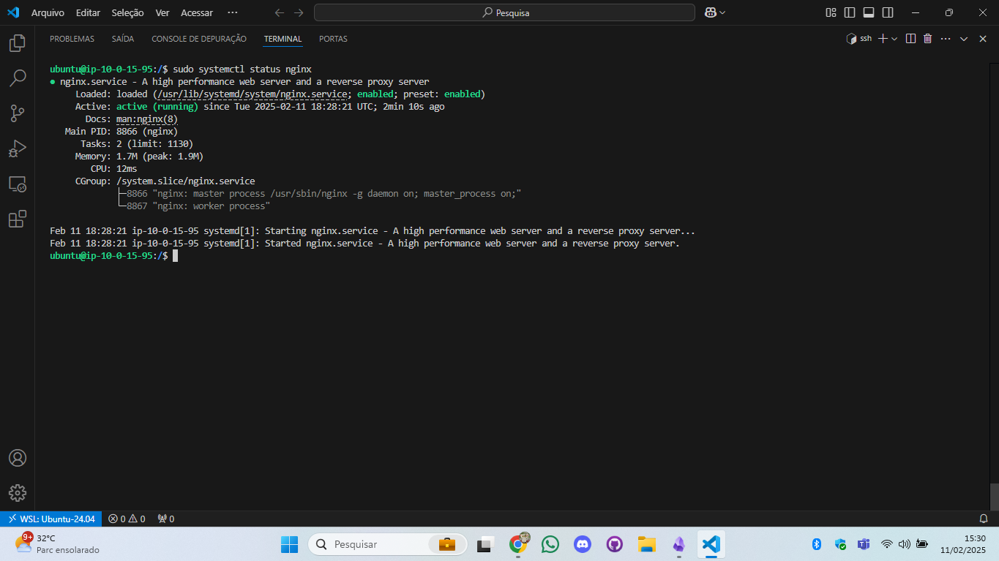

# Configuração do Servidor

1) Instalar o servidor Nginx na EC2.<br>
> [!NOTE]
> Passo a passo instalação:<br><ol><li>buscar e instalar atualizações:<ul><li>sudo apt update<li>sudo apt upgrade -y</ul><li>fazer a instalação do ngnix:<ul><li>sudo apt install nginx</ul>


2) Criar uma página HTML simples para ser exibida pelo servidor.<br>

> [!NOTE]
> Para alterar a pagina padrão do ngnix acesse:<br>**cd var/www/html/index.html**

> [!WARNING]
> Para enviar as imagens caso utilize elas no html.<br>**UBUNTU**: scp -i /home/daiji/chavew11.pem /home/daiji/2.3.png /home/daiji/3.png ubuntu@ec2-44-202-123-130.compute-1.amazonaws.com:/home/ubuntu/images/ <br><br> **LINUX**: scp -i /home/daiji/chavew11.pem /home/daiji/img/1.png /home/daiji/img/2.1.png /home/daiji/img/2.2.png /home/daiji/img/2.3.png /home/daiji/img/3.png /home/daiji/img/4.1.png /home/daiji/img/4.2.png /home/daiji/img/teste1.png /home/daiji/img/teste2.png /home/daiji/img/teste3.png  ec2-user@ec2-3-82-154-220.compute-1.amazonaws.com:/usr/share/nginx/html/<br><br>Importante salientar que pra mover as imagens diretamente aonde está o html você tera que dar as permissões **777** para a pasta.

<details align="left">
    <summary style="color: #9400D3;">Estrutura do site HTML:</summary>

```
<!DOCTYPE html>
<html lang="pt-BR">
<head>
<meta charset="UTF-8">
<meta name="viewport" content="width=device-width, initial-scale=1.0">
<meta name="description" content="Configuração de Servidor Web com Monitoramento - Guia completo para configurar e monitorar um servidor web na AWS.">
<meta name="keywords" content="AWS, EC2, Nginx, Monitoramento, Servidor Web, VPC">
<title>Configuração de Servidor Web com Monitoramento</title>
<style>
        body {
            font-family: Arial, sans-serif;
            background-color: #282a36;
            color: #f8f8f2;
            margin: 0;
            padding: 0;
        }
        header {
            background-color: #44475a;
            padding: 20px;
            text-align: center;
            color: #f8f8f2;
            font-size: 24px;
        }
        .container {
            max-width: 800px;
            margin: 20px auto;
            padding: 20px;
            background-color: #44475a;
                   border-radius: 10px;
            box-shadow: 0 0 10px rgba(0, 0, 0, 0.5);
        }
        h1, h2 {
            color: #bd93f9;
        }
        img {
            max-width: 100%;
            height: auto;
            border-radius: 5px;
            margin: 10px 0;
            border: 2px solid #6272a4;
        }
        .tips {
            background-color: #6272a4;
            padding: 15px;
            border-radius: 5px;
            margin: 15px 0;
        }
        .tips p {
            margin: 0;
            color: #f8f8f2;
        }
        footer {
            text-align: center;
            padding: 20px;
            background-color: #44475a;
            color: #f8f8f2;
                    margin-top: 20px;
        }
        a {
            color: #8be9fd;
            text-decoration: none;
            transition: color 0.3s ease;
        }
        a:hover {
            color: #ff79c6;
            text-decoration: underline;
        }
        ol, ul {
            color: #f8f8f2;
        }
        @media (max-width: 600px) {
            .container {
                padding: 10px;
            }
            header {
                font-size: 20px;
            }
        }
 </style>
 </head>
 <body>
 <header>
 Configuração de Servidor Web com Monitoramento
 </header>
 <div class="container">
 <h1>Configuração do Ambiente</h1>
 <h2>Tarefas:</h2>
 <ol>
 <li>
 Criar uma VPC na AWS com:
 <ul>
 <li>2 sub-redes públicas (para acesso externo).</li>
 <li>2 sub-redes privadas (para futuras expansões).</li>
 <li>Uma Internet Gateway conectada às sub-redes públicas.</li>
 </ul>
 
 </li>
 <li>
 Criar uma instância EC2 na AWS:
 <ul>
 <li>Escolher uma AMI baseada em Linux (Ubuntu/Debian/Amazon Linux).</li>
 <li>Instalar na sub-rede pública criada anteriormente.</li>
 <li>Associar um Security Group que permita tráfego HTTP (porta 80) e SSH (porta 22, opcional).</li>
 </ul>
 
 
 </li>
 <li>
 Acessar a instância via SSH para realizar configurações futuras.
 
 </li>
 </ol>
  <h1>Configuração do Servidor</h1>
 <h2>Tarefas:</h2>
 <ol>
 <li>
 Instalar o servidor Nginx na EC2.
 
 </li>
 <li>
 Criar uma página HTML simples para ser exibida pelo servidor.
 <pre><code>
 </code></pre>
 </li>
 <li>
 Configurar o Nginx para servir a página corretamente.
 </li>
 </ol>
 <div class="tips">
 <p><strong>Dicas para os alunos:</strong></p>
 <ul>
 <li>Personalizar a página com informações sobre o projeto.</li>
 <li>Criar um serviço systemd para garantir que o Nginx reinicie automaticamente se parar.</li>
 </ul>
 </div>
 <h1>Monitoramento e Notificações</h1>
 <h2>Tarefas:</h2>
 <ol>
 <li>
 Criar um script em Bash ou Python para monitorar a disponibilidade do site.
 </li>
 <li>
 O script deve:
 <ul>
 <li>Verificar se o site responde corretamente a uma requisição HTTP.</li>
 <li>Criar logs das verificações em /var/log/monitoramento.log</li>
 <li>Enviar uma notificação via Discord, Telegram ou Slack se detectar indisponibilidade.</li>
 </ul>

 </li>
<li>
Configurar o script para rodar automaticamente a cada 1 minuto usando cron ou systemd timers.

</li>
</ol>
<div class="tips">
<p><strong>Dicas para os alunos:</strong></p>
<ul>
<li>Usar curl no Bash ou requests no Python para testar a resposta do site.</li>
<li>Configurar um bot do Telegram ou webhook do Discord/Slack para receber alertas.</li>
</ul>
</div>
<h1>Automação e Testes</h1>
<h2>Tarefas:</h2>
<ol>
<li>
Testar a implementação:
<ul>
<li>Verificar se o site está acessível via navegador.</li>
<li>Parar o Nginx e verificar se o script detecta e envia alertas corretamente.</li>
</ul>
</li>
<li>
Criar uma documentação no GitHub explicando:
<ul>
<li>Como configurar o ambiente.</li>
<li>Como instalar e configurar o servidor web.</li>
<li>Como funciona o script de monitoramento.</li>
<li>Como testar e validar a solução.</li>
</ul>
</li>
</ol>
<div class="tips">
<p><strong>Dicas para os alunos:</strong></p>
<ul>
<li>Explicar os comandos usados na documentação.</li>
<li>Compartilhar prints dos testes.</li>
</ul>
</div>


<div class="tips">
<p><strong>Repositório do GitHub:</strong></p>
<p>
Acesse o repositório do projeto no GitHub para ver a documentação completa e o código-fonte:
<a href="https://github.com/Daijinpala/projeto_1.git" target="_blank">GitHub - Projeto 1</a>
</p>
</div>
</div>
<footer>
&copy; 2025 - Configuração de Servidor Web com Monitoramento |
<a  href="https://github.com/Daijinpala/projeto_1.git" target="_blank">Repositório no GitHub</a>
</footer>
</body>
</html>
```
</details><br>

3) Configurar o Nginx para servir a página corretamente.
> [!NOTE]
> Comando que verifica se o serviço está ativado:<br>**sudo systemctl status nginx**<br>


