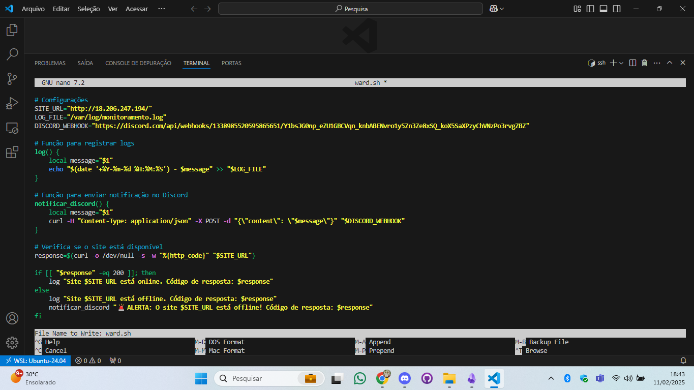
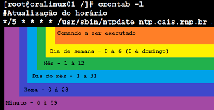

# Configuração do Monitoramento e notificação

> [!IMPORTANT]
> foi utilizado o bash na criação do script e o crontab para a loop do script; É possivel utilizar outros meios de criação como o a linguagem Python e systemd para o loop.

1) Criar um script em Bash ou Python para monitorar a disponibilidade do site.

> [!NOTE]
>Como dito acima, será utilizado bash.



2) O script deve:
- Verificar se o site responde corretamente a uma requisição HTTP.
- Criar logs das verificações em /var/log/monitoramento.log.
Enviar uma notificação via Discord, Telegram ou Slack se detectar indisponibilidade.
- Configurar o script para rodar automaticamente a cada 1 minuto usando cron ou systemd timers.

<details align="left">
    <summary style="color: #9400D3;">Estrutura do script: </summary>

```
#!/bin/bash
#SITE_URL="http://44.202.123.130/"

# Configurações
SITE_URL="http://localhost" #ipv4 publico ou hostname do site
LOG_FILE="/var/log/monitoramento.log" #arquivo que será mandado os logs
DISCORD_WEBHOOK="https://discord.com/api/webhooks/1338985520595865651/Y1bsJG0np_eZU1GBCVqn_knbABENvro1y5Zn3Ze8xSQ_koX5SaXPzyChVNzPo3rvgZBZ" #o meu webhook do discord (link)

#Registrar os logs
log() {
    local message="$1"
    echo "$(date '+%Y-%m-%d %H:%M:%S') - $message" >> "$LOG_FILE"
}

#Enviar a notificação no Discord
notificar_discord() {
    local message="$1"
    curl -H "Content-Type: application/json" -X POST -d "{\"content\": \"$message\"}" "$DISCORD_WEBHOOK"
}

# Verifica se o site está disponível
response=$(curl -o /dev/null -s -w "%{http_code}" "$SITE_URL")

if [[ "$response" -eq 200 ]]; then
    log "Site $SITE_URL está online. Código de resposta: $response"
else
    log "Site $SITE_URL está offline. Código de resposta: $response"
    notificar_discord "🚨 ALERTA: O site $SITE_URL está offline! Código de resposta: $response"
fi
```
</details><br>

> [!CAUTION]
> Após a criação do script.sh transformar ele em um arquivo executavel com o:<br>**chmod +x nome_do_arquivo.sh**<br>

> [!TIP]
> explicação do código:
```
Primeiro foi definido as variáveis:<br>
**SITE_URL =** contém o ipv4 publico da maquina ou o hostname do site.
**LOG_FILE =** "var/log/monitoramento.log" especifica o caminho e nome do arquivo que será criado dentro do /log.<br>
**DISCORD_WEBHOOK =** contem a url do webhook que criei para a finalidade de me notificar.

**log() {}**
criei uma função com o nome de log (é um bloco de código que pode ser "chamado" varias vezes em um código)<br>

**local message="$1"**
logo após isso criei uma variável local com o nome message e passei um argumento pra dentro dessa variável.(seria o equivalente ao iniciar uma variável em uma linguagem de programação).<br>

**echo "$(date '+%Y-%m-%d %H:%M:%S') - $message" >> "$LOG_FILE"**<br>
ele vai mostrar na tela com o comando echo a data e o conteúdo que está dentro de message e mandar todo este texto concatenado para dentro do meu arquivo de log definido anteriormente na iniciação das variáveis.<br>

**notificar_discord() {}** <br>
criei uma função para notificar no discord

**local message="$1"**<br>
novamente crio uma variável local e por fim atribuo a ela um argumento.

**curl -H "Content-Type: application/json" -X POST -d "{\"content\": \"$message\"}" "$DISCORD_WEBHOOK"**<br><br>
o comando **curl é usado para usado para fazer uma requisição** <br>o **-H adiciona um cabeçalho**, no caso do exemplo acima foi utilizado este **"Content-Type: application/json"** especifica que os dados que serão enviados estão no formato **JSON**, **-X** especifica o método que no caso é o **POST** define o método de envio, o **-d** é usado para enviar dados em que terá o **conteúdo** a variável **message** e a **variável que tem o link do webhook**.<br>

**response=$(curl -o /dev/null -s -w "%{http_code}" "$SITE_URL")**<br>
é criado mais uma variável **response** que tem a finalidade de ver se o site está online, **curl** faz a requisição **-o** redireciona a saída da requisição para um arquivo "/dev/null" descarta qualquer conteúdo escrito nele **-s** é o **silente mode** não exibe o progresso da requisição ou mensagem de erro **-w** personaliza a saída da requisição, **"%{http_code}"** pega o código da pagina e por fim o  "$SITE_URL" que é a variável que contem o ip da minha pagina da web.


if [[ "$response" -eq 200 ]]; then
    log "Site $SITE_URL está online. Código de resposta: $response"
else
    log "Site $SITE_URL está offline. Código de resposta: $response"
    notificar_discord "🚨 ALERTA: O site $SITE_URL está offline! Código de resposta: $response"
fi

Um teste condicional que se o a pagina estiver funcionando ele vai mandar o status dele pra dentro do meu log e caso não esteja ele irá notificar o discord.
```

3) Configurar o script para rodar automaticamente a cada 1 minuto usando cron ou systemd timers.

> [!TIP]
> Como foi feito utilizando o cron?<br><br>abrir o crontab:<br>**crontab -e**<br>selecionar o editor de texto que mais te agrada! (no meu caso foi o nano), na ultima linha do arquivo adicionar o script criado anteriormente:<br>* */1 * * * * /var/www/html/ward.sh<br>* *: campos que deixei em branco<br>/1: quantidade de minutos para executar o script<br>/var/www/html/ward.sh o caminho para o executável que criei anteriormente.<br> caso queira testar<br>**./ward.sh** (tem que estar na pasta do arquivo) 


