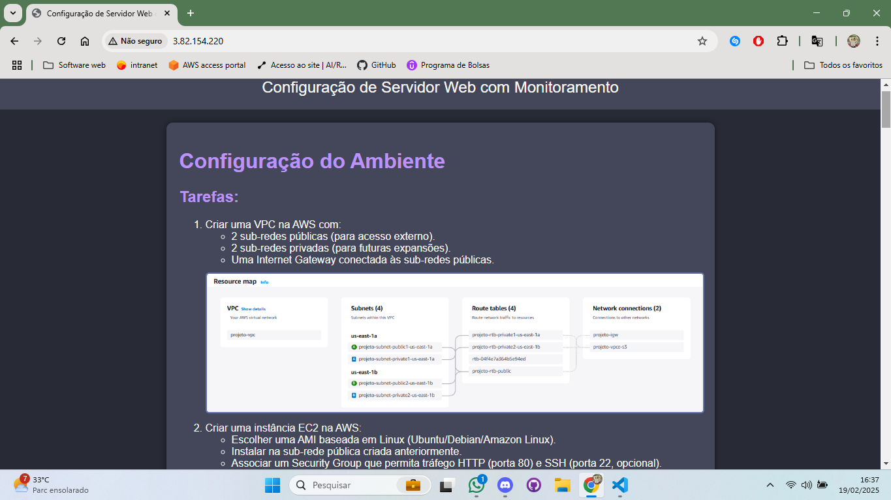
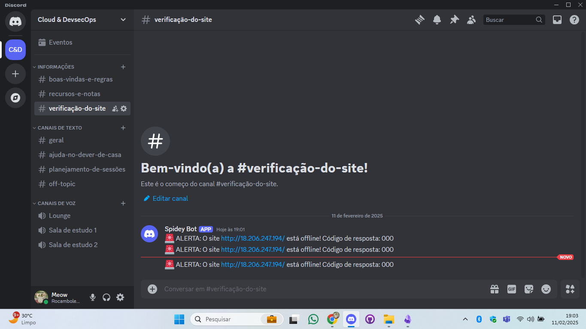

# Automação e Testes

1) Verificar se o site está acessível via navegador. 

2) Parar o Nginx e verificar se o script detecta e envia alertas corretamente.
 

3) Criar uma documentação no GitHub explicando:
- Como configurar o ambiente.
- Como instalar e configurar o servidor web.
- Como funciona o script de monitoramento.
- Como testar e validar a solução.

  [GitHub](https://github.com/Daijinpala/projeto_1/tree/main)